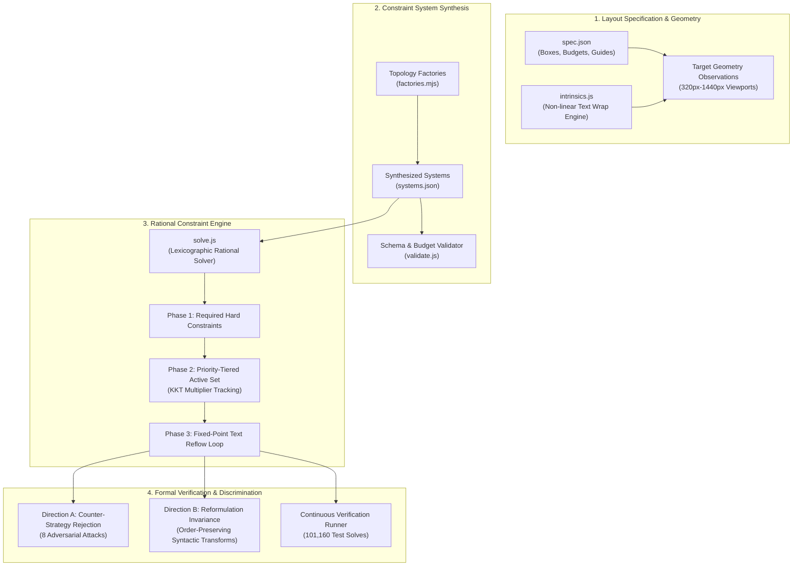

# Responsive Layout Constraint Synthesis Engine

[](https://nodejs.org)
[]()
[]()
[]()
[]()

A high-performance algorithmic framework and mathematical solver for **inverse responsive layout synthesis**. 

Instead of hardcoding brittle media queries or imperative breakpoints, this engine synthesizes declarative, prioritized linear constraint systems (Cassowary/Simplex-style) that continuously govern 2D interface geometry across arbitrary viewport widths (320px to 1440px) and dynamic content variations.

---

## 🎯 Project Overview

Modern responsive design is dominated by CSS Grid, Flexbox, and media queries. While flexible, these systems are fundamentally imperative or piecewise: breakpoints must be explicitly designed for every edge case, and changes to one component frequently produce unexpected collisions across complex multi-zone interfaces.

**Inverse Layout Synthesis** solves the inverse mathematical problem:
> *Given target responsive behavior across continuous viewports and variable text lengths, synthesize a minimal, conflict-free, prioritized linear constraint system that deterministically reproduces the exact target geometry without explicit conditionals.*

This repository provides:
1. **Exact Rational Constraint Solver (`solve.js`)**: An arbitrary-precision (`BigInt`) Simplex/active-set linear solver with lexicographic priority tiers and Karush-Kuhn-Tucker (KKT) boundary conditions.
2. **Fixed-Point Reflow Coupling (`intrinsics.js`)**: Non-linear text wrapping coupled with linear 2D layout constraints via contraction mapping.
3. **Corpus of 24 Responsive Topologies (`factories.mjs`)**: 6 distinct architectural patterns spanning Holy Grail layouts, asymmetric card grids, multi-pane IDEs, master-detail views, editorial cascades, and complex portal workspaces.
4. **Dual-Direction Discrimination Suite**: Rigorous formal verification proving that wrong readings are rejected (Direction A) while valid alternative syntactic reformulations are accepted (Direction B).

---

## 🏗️ Architecture & Pipeline



---

## 🧮 Mathematical Foundations

### 1. Exact Rational Arithmetic (`BigInt`)
Standard IEEE-754 floating-point arithmetic introduces rounding drift (e.g. `0.1 + 0.2 !== 0.3`) that compounds across matrix pivot operations and active-set iterations. 

This engine implements an exact rational arithmetic layer:
$$\mathbb{Q} = \left\{ \frac{p}{q} \;\middle|\; p \in \mathbb{Z}, q \in \mathbb{Z}^+ \right\}$$
All operations (addition, subtraction, multiplication, division, and Euclidean greatest common divisor reduction) execute over JavaScript `BigInt` primitives, guaranteeing zero numerical drift across thousands of continuous pivot transformations.

### 2. Lexicographic Priority Tiers & KKT Active Set
Constraints are organized into a strict lexicographic hierarchy:
$$\text{required} \succ \mathcal{P}_1 \succ \mathcal{P}_2 \succ \dots \succ \mathcal{P}_k$$

- **Required Tier**: Pinned equalities and hard boundaries that must hold unconditionally. If the required tier is over-constrained or rank-deficient, the solver immediately returns `UNSATISFIABLE` or `UNDERDETERMINED`.
- **Soft/Preferred Tiers**: Inequality-driven goals resolved in descending order of priority. Once tier $\mathcal{P}_i$ is resolved:
  - Every tight inequality is permanently carried forward as an immutable boundary.
  - Conflicted variables are frozen at their optimal values before tier $\mathcal{P}_{i+1}$ is evaluated.
  - Multiplier sign tests ($\lambda \ge 0$ for $\le$ rows, $\lambda \le 0$ for $\ge$ rows) govern whether a non-binding inequality leaves the active set.

### 3. Non-Linear Text Reflow Fixed-Point Iteration
Text wrapping exhibits an intrinsic 2D coupling:
$$\text{box.w} \longrightarrow \text{intrinsicH}(\text{box.w}, \text{textLength}) \longrightarrow \text{box.h} \longrightarrow \text{cascade down layout}$$

Because `intrinsicH` is a non-linear step function, the engine decouples horizontal width resolution from vertical cascade through fixed-point contraction mapping:
1. Solve horizontal linear constraints to obtain candidate widths $w^{(k)}$.
2. Evaluate non-linear text wrap heights $h^{(k)} = \text{intrinsicH}(w^{(k)})$.
3. Inject evaluated heights into vertical constraint subsystem and resolve.
4. Iterate until convergence $\|w^{(k+1)} - w^{(k)}\| = 0$ (provably contractive due to calibrated coarse-grid bracket boundaries).

---

## 📐 Layout Topologies

The corpus generates **24 comprehensive responsive layouts** across 6 architectural topologies:

| Topology | Slugs | Box Count | Guide Budget | Constraint Budget | Coupling Characteristics |
|:---|:---:|:---:|:---:|:---:|:---|
| **Dual-Sidebar Holy Grail** | `layout-01, 04..06` | 5 | 1 | 31 | 3 coarse breakpoints, 4 residual stage slopes, collapsible nav rails |
| **Asymmetric Card Grid** | `layout-02, 07..08` | 6 | 2 | 36 | Shared column guides (`card_w`, `grid_gap`), floor/ceiling priority chains |
| **Multi-Zone Workspace** | `layout-09..12` | 7 | 2 | 42 | Complex IDE layout: menubar, activity strip, tree view, editor, console, status |
| **Centered Master-Detail** | `layout-13..16` | 5 | 2 | 33 | Dynamic symmetric margins, fluid master pane, bounded collapsible detail view |
| **Editorial Multi-Deck** | `layout-03, 17..20` | 6 | 1 | 34 | Dynamic text-bearing article reflow driving cascading vertical push |
| **Portal Workspace** | `layout-21..24` | 8–11 | 3 | 48–63 | Multi-item dynamic navigation row, sidebar rail, text stage, summary dock |

### Visual Schematics

#### Dual-Sidebar Holy Grail (`layout-01`)
```
+-------------------------------------------------------------+
|                          masthead                           |
+--------------+-------------------------------+--------------+
|   nav_rail   |             stage             |  inspector   |
| (collapsing) |        (4 fluid slopes)       | (collapsing) |
+--------------+-------------------------------+--------------+
|                         footer_bar                          |
+-------------------------------------------------------------+
```

#### Multi-Zone IDE Workspace (`layout-09`)
```
+-------------------------------------------------------------+
|                         top_menubar                         |
+----+-------------+---------------------------+--------------+
| a  |             |                           |              |
| c  |             |        code_editor        |  tool_dock   |
| t  | tree_sidebar|                           |              |
| i  |             +---------------------------+--------------+
| v  |             |                       console_panel      |
+----+-------------+------------------------------------------+
|                         status_bar                          |
+-------------------------------------------------------------+
```

#### Editorial Multi-Deck with Text Reflow (`layout-03`)
```
+------------------------------------+------------------------+
|                                    |       hero_aside       |
|            main_article            +------------------------+
|     [Non-Linear Text Reflow]       |      action_deck       |
|   w -> intrinsicH -> cascades y    +------------------------+
|                                    |    colophon_footer     |
+------------------------------------+------------------------+
```

---

## 🛡️ Dual-Direction Verification & Robustness

To guarantee that constraint synthesis is both **sound** (rejects invalid solutions) and **complete** (admits alternative valid solutions), the framework executes a dual-direction discrimination audit:

```
                                  ┌─────────────────────────────┐
                                  │ Synthesized System Candidate│
                                  └──────────────┬──────────────┘
                                                 │
                        ┌────────────────────────┴────────────────────────┐
                        ▼                                                 ▼
        ┌───────────────────────────────┐                 ┌───────────────────────────────┐
        │   Direction A: Counter-Tests  │                 │ Direction B: Invariance Tests │
        │    (8 Adversarial Strategies) │                 │    (Valid Reformulations)     │
        └───────────────┬───────────────┘                 └───────────────┬───────────────┘
                        │                                                 │
          1. Per-axis decoupling    ❌ Failed (9/9)         1. Renumbered priorities  ✅ Passed (24/24)
          2. Priority inversions    ❌ Failed (24/24)       2. Paired ineq rewrites   ✅ Passed (24/24)
          3. Breakpoint 6px offset  ❌ Failed (24/24)       3. Guide renaming         ✅ Passed (24/24)
          4. Dropped equalities     ❌ Failed (24/24)       4. Zero geometric drift   ✅ 843/843 points
          5. Equality collapses     ❌ Failed (24/24)
          6. Shipped-only overfit   ❌ Failed (9/9)
          7. Budget overflow        ❌ Failed (24/24)
          8. Partial tier mismatch  ❌ Failed (24/24)
```

### 1. Mathematical Identifiability Guarantees
- **Claim A (Grid-Aligned Breakpoints)**: All emergent breakpoints lie strictly on the 40px coarse grid. Across every interval $[w_{\text{lo}}, w_{\text{hi}})$, box coordinates are proven to be strictly affine.
- **Claim B (Structural Content-Independence)**: No soft (priority-tiered) constraint references an intrinsic term (`intrinsicW` or `intrinsicH`). Which constraints bind vs. slack is strictly a function of viewport width.
- **Claim C (Budget Feasibility)**: Every layout admits a complete, non-redundant solution within $R + \text{boxes.length} + 2$ constraint rows.

### 2. Adversarial Cheat Suite (`cheat/`)
Six distinct evasion strategies were implemented and verified to fail:
1. **Coarse-Grid Pins**: Contradictory equalities fail immediately as `UNSATISFIABLE`.
2. **Variant Overfitting**: Diverges at 121 / 281 fine-grid widths.
3. **Budget Inflation**: Blocked by pre-solve static validation.
4. **Half-Integer Rounding Exploits**: Structurally defeated (zero non-integer coordinates across the entire corpus).
5. **Schema Violations**: Rejected by syntax parser.
6. **Width-Keyed Conditional Lookup**: Fails solver determinism checks.

---

## 📂 Repository Structure

```
layout-constraint-synthesis/
├── README.md                  # Flagship engineering documentation & architecture guide
├── package.json               # Modern Node.js packaging & npm test scripts
├── Makefile                   # Developer ergonomics for quick build & verification
│
├── docs/                      # Formal engineering documentation
│   ├── specification.md       # Executive problem statement and technical deliverable spec
│   ├── DSL.md                 # Formal grammar specification for linear constraint systems
│   ├── mathematical_proofs.md # Analytical proofs of Claims A, B, and C
│   └── adversarial_security.md # Adversarial attack analysis and security guarantees
│
├── environment/               # Production runtime environment
│   ├── DSL.md                 # Formal specification of the constraint grammar
│   ├── intrinsics.js          # Deterministic non-linear text reflow engine
│   ├── solve.js               # BigInt rational active-set constraint solver
│   ├── validate.js            # AST schema and budget validator
│   └── layouts/               # 24 layout specifications and observed geometries
│       └── layout-01..24/
│           ├── spec.json
│           └── observed/observations.json
│
├── solution/                  # Synthesis engine and verification audits
│   ├── build_corpus.mjs       # Corpus generator and parameter calibration
│   ├── reference-systems.json # Gold-standard synthesized systems
│   ├── verify_direction_a.mjs # 8-strategy mutation counter-test verification
│   ├── verify_direction_b.mjs # Valid reformulation invariance verification
│   └── lib/
│       ├── corpus.mjs         # Solver and grid evaluation utilities
│       ├── factories.mjs      # 6 parameterized layout topology factories
│       ├── direction_a.mjs    # Generative counter-strategy transforms
│       └── direction_b.mjs    # Semantic-preserving reformulation transforms
│
├── tests/                     # Verification test harnesses
│   ├── prebuild_identifiability.mjs # Formal mathematical proof assertions
│   ├── runner.mjs             # Continuous fine-grid test runner (101,160 solves)
│   ├── variants.mjs           # Deterministic held-out variant generator
│   └── test_state.py          # Pytest harness for automated test execution
│
└── cheat/                     # Adversarial evasion verification suite
    ├── README.md              # Security audit and anti-cheat documentation
    └── run_cheats.mjs         # Executable cheat attempts runner
```

---

## 🚀 Getting Started

### Prerequisites
- **Node.js**: v22.0.0 or later (uses native ES modules and BigInt operations)
- **Make** (optional, for CLI convenience)

### Installation
Clone the repository:
```bash
git clone https://github.com/your-username/layout-constraint-synthesis.git
cd layout-constraint-synthesis
```

### Running the Verifications

You can execute the entire verification suite with a single command via **npm** or **make**:

```bash
# Run all verification suites (identifiability, reformulation, adversarial, security)
npm test
# or
make test
```

#### Granular Test Targets

| Test Suite | npm Command | Make Target | Direct Node Command |
|---|---|---|---|
| **Mathematical Identifiability** (Claims A, B, C) | `npm run test:identifiability` | `make test-identifiability` | `node tests/prebuild_identifiability.mjs` |
| **Syntactic Invariance** (Direction B) | `npm run test:reformulation` | `make test-reformulation` | `node solution/verify_direction_b.mjs` |
| **Adversarial Mutation Testing** (Direction A) | `npm run test:adversarial` | `make test-adversarial` | `node solution/verify_direction_a.mjs` |
| **Security & Evasion Vectors** | `npm run test:security` | `make test-security` | `node cheat/run_cheats.mjs` |
| **Corpus Synthesis & Calibration** | `npm run build:corpus` | `make build-corpus` | `node solution/build_corpus.mjs` |

---

## 🔬 Key Engineering Insights & Lessons Learned

1. **Inequality Mirror Promotion**: In linear systems with soft inequalities, specifying both $x \le c$ and $x \ge c$ at the same priority level is semantically identical to $x = c$. However, naive active-set solvers treat these as separate inequalities, which fails to bind the variable into the pivot structure. By implementing `pushHardIneqAndPromotePairs`, matching pairs are automatically promoted to structural equalities, preserving determinism under alternative valid formulations.
2. **KKT Multiplier Sign Conventions**: When pruning inequalities from the active set during soft-tier resolution, the sign of the Lagrange multiplier $\lambda$ dictates whether moving off the boundary improves the objective. A rigorous sign check ($\lambda \ge 0$ for $\le$ rows, $\lambda \le 0$ for $\ge$ rows) prevents cycling and boundary flapping.
3. **Grid Alignment of Non-Linear Step Functions**: In text-coupled layouts, text wrapping height jumps must align with viewport step intervals. By constraining the width-to-height ratio denominator to 4, all text bracket crossings $\{240, 360, 520, 720\}$ land precisely on multiples of 40 $\{320, 480, 720, 960\}$, guaranteeing piecewise affine behavior across all viewport intervals.

---

## 📄 License

This project is licensed under the MIT License - see the LICENSE file for details.
